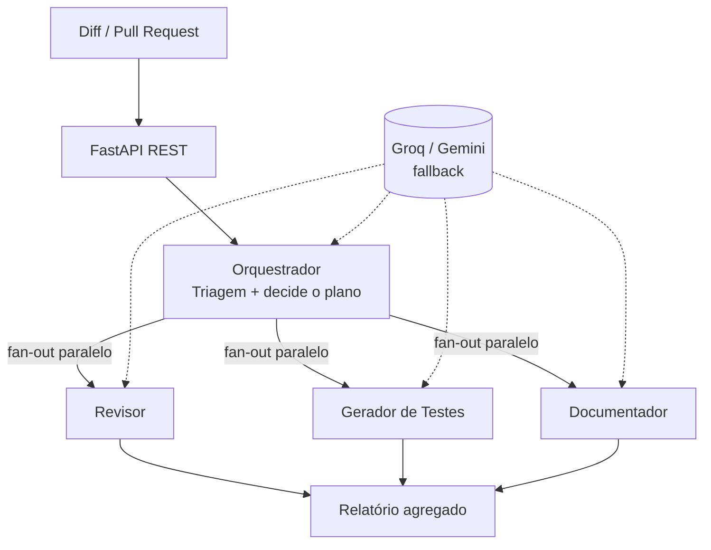

# DevFlow AI

Plataforma **agêntica** de apoio ao ciclo de vida de software (SDLC). Recebe
mudanças de código (diffs / Pull Requests) e executa agentes de IA
especializados que **revisam código, geram testes, documentam e triam** —
entregando feedback automático como um revisor sênior faria.

Construído 100% em **free tier** (Groq + Google Gemini), com rigor de SDLC
(testes, CI/CD, IaC, containers).

## Demo

```bash
# 1) analisar um diff local
python demo.py            # usa um diff de exemplo

# 2) analisar um Pull Request real do GitHub (E2E)
python analisar_pr.py https://github.com/owner/repo/pull/123
python analisar_pr.py https://github.com/owner/repo/pull/123 --post   # comenta no PR
```

> _(coloque aqui o GIF da demo: `docs/demo.gif`)_

## Arquitetura



O **Orquestrador tria o PR e decide quais agentes rodar** — o fluxo se adapta ao
conteúdo da mudança. Orquestração feita com **LangGraph**.

## Status

| Fase | Entregável | Status |
|------|-----------|--------|
| **1** | API REST + Agente Revisor (Groq + fallback Gemini) | Concluído |
| **2** | Multi-agente com LangGraph (Revisor, Testes, Docs, Triagem) | Concluído |
| 3 | RAG do código (Qdrant + embeddings) | Planejado |
| 4 | Persistência (Postgres + MongoDB) | Planejado |
| **5** | Integração GitHub: analisa PR via API + posta comentário | Parcial (falta webhook + n8n) |
| 6 | Harness de avaliação (eval) | Planejado |
| 7 | Docker + Terraform + CI/CD + deploy | Planejado |
| 8 | Dashboard (Streamlit) | Planejado |

## Stack

Python · FastAPI · Groq (Llama 3.3 70B) · Gemini 2.0 Flash · LangGraph ·
Qdrant · Postgres · MongoDB · n8n · Docker · Terraform · GitHub Actions

## Como rodar (Fase 1)

```bash
# 1. ambiente
py -m venv .venv
.venv/Scripts/activate          # Windows
pip install -r requirements.txt

# 2. credenciais (free tier)
cp .env.example .env
# preencha GROQ_API_KEY  -> https://console.groq.com/keys
# (opcional) GEMINI_API_KEY -> https://aistudio.google.com/app/apikey

# 3. subir a API
uvicorn app.main:app --reload

# 4. abrir a documentação interativa
# http://127.0.0.1:8000/docs
```

> Obs.: a porta **8000 é bloqueada** em alguns ambientes Windows corporativos;
> use `--port 8123` (ou outra) se necessário.

### Endpoints

- `GET /health` — healthcheck
- `POST /review` — roda só o agente Revisor sobre um diff
- `POST /analyze` — roda o **pipeline multi-agente** (orquestrador decide o plano)
- `POST /analyze/pr` — busca o diff de um **PR do GitHub**, analisa e (opcional) comenta no PR

### Testar via curl

```bash
# pipeline completo multi-agente
curl -X POST http://127.0.0.1:8123/analyze \
  -H "Content-Type: application/json" \
  -d '{"diff": "def soma(a,b): return a-b", "language": "python"}'
```

## Arquitetura (alvo)

```
GitHub PR ─► FastAPI ─► Orquestrador (LangGraph)
                          ├─ Revisor
                          ├─ Gerador de Testes
                          ├─ Documentador
                          └─ Triador
                              └─► comenta no PR + Postgres/Mongo + n8n
```
