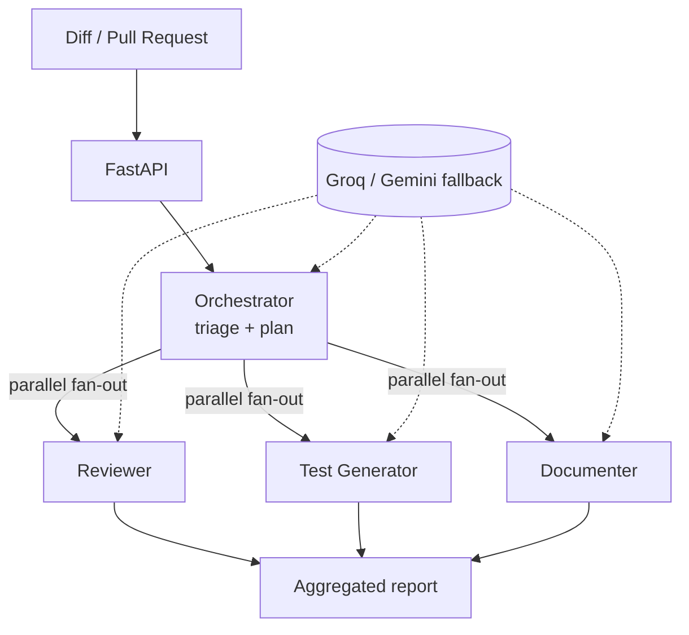

# DevFlow AI

An agentic platform that supports the software development lifecycle. It takes a
code change (a diff or a Pull Request) and runs a set of specialized AI agents that
**review the code, generate tests, write documentation and triage the change** —
posting feedback back on the PR the way a senior reviewer would.

It runs entirely on free tiers (Groq, with Google Gemini as a fallback).

## How it works

A single request flows through the system like this:

1. A diff (or a GitHub PR) comes in.
2. An **orchestrator** triages the change: it classifies risk and area, and
   decides which agents are worth running.
3. The selected agents run **in parallel**:
   - **Reviewer** — finds bugs, security flaws, performance and style issues.
   - **Test Generator** — writes automated tests for the new code.
   - **Documenter** — produces docstrings and usage notes.
4. The results are aggregated into a single report.

Because the orchestrator picks the agents based on the content of the change, the
flow adapts: a README-only PR runs just the Documenter, while a change to auth code
runs all three.



The orchestration is built with **LangGraph**: a shared state object flows through
a graph, each agent writes to its own key (so parallel runs never conflict), and a
conditional edge fans out only to the agents in the plan.

## Tech stack

Python · FastAPI · LangGraph · Groq (Llama 3.3 70B) · Gemini 2.0 Flash ·
GitHub API · GitHub Actions

## Project layout

```
app/
  main.py            REST API (FastAPI)
  config.py          settings loaded from environment / .env
  schemas.py         request and response models (Pydantic)
  graph.py           LangGraph orchestration
  report.py          renders the result as a markdown PR comment
  llm/client.py      multi-provider LLM client (Groq -> Gemini fallback)
  agents/            reviewer, testgen, documenter, triager
  sources/github.py  fetch a PR diff and post a comment
demo.py              run the pipeline on a local diff
analyze_pr.py        run the pipeline on a GitHub PR
.github/workflows/   GitHub Actions workflow that reviews PRs automatically
```

## Setup

```bash
python -m venv .venv
.venv/Scripts/activate            # Windows
pip install -r requirements.txt

cp .env.example .env
# set GROQ_API_KEY (https://console.groq.com/keys)
# set GITHUB_TOKEN to read PRs and post comments (https://github.com/settings/tokens)
```

> On some corporate Windows setups port 8000 is blocked. Use another port, e.g.
> `--port 8123`.

## Usage

### Analyze a local diff

```bash
python demo.py                    # uses a sample diff
python demo.py path/to/change.diff
```

You can turn any repository change into a diff with `git diff > change.diff`.

### Analyze a GitHub Pull Request

```bash
python analyze_pr.py https://github.com/owner/repo/pull/123
python analyze_pr.py https://github.com/owner/repo/pull/123 --post   # comment on the PR
```

### As a service

```bash
uvicorn app.main:app --reload --port 8123
# interactive docs at http://127.0.0.1:8123/docs
```

Endpoints:

- `GET /health` — health check
- `POST /review` — run only the reviewer on a diff
- `POST /analyze` — run the full multi-agent pipeline on a diff
- `POST /analyze/pr` — fetch a GitHub PR diff, analyze it, optionally comment

## Automatic reviews on every PR (GitHub Actions)

The workflow in `.github/workflows/pr-review.yml` runs the pipeline on every Pull
Request and posts the review as a comment automatically. To enable it:

1. Add a repository secret `GROQ_API_KEY` (Settings → Secrets and variables →
   Actions). The built-in `GITHUB_TOKEN` is used to post the comment, so no other
   secret is needed.
2. Open or update a Pull Request — the review appears as a comment.

## Design notes

- **Provider abstraction with fallback.** The LLM client tries Groq first and falls
  back to Gemini, so the rest of the system never depends on a single provider.
- **Structured vs. free-form output.** Agents with short, structured output
  (Reviewer, Triager) return JSON; agents that generate code or prose (Test
  Generator, Documenter) return plain text, because embedding code inside a JSON
  string is fragile and breaks parsing.
- **Tolerant JSON parsing.** Model output is not always valid JSON, so the parser
  strips code fences, isolates the object, and handles literal control characters
  and invalid escape sequences.

## Roadmap

| Stage | Scope | Status |
|------|-------|--------|
| 1 | REST API + reviewer agent | Done |
| 2 | Multi-agent orchestration (LangGraph) | Done |
| 3 | Code RAG (vector search over the repo) | Planned |
| 4 | Persistence (Postgres + MongoDB) | Planned |
| 5 | GitHub integration: analyze PR, comment, CI workflow | Done |
| 6 | Evaluation harness | Planned |
| 7 | Docker + Terraform + deploy | Planned |
| 8 | Dashboard | Planned |
